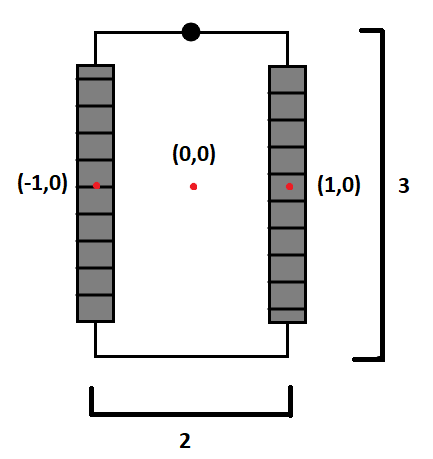

# Writing your first program for the robot

Make sure you have followed all of the [Setup Instructions](../setup) to install Python 3, pyfrc, Visual Studio Code with Python support, Driver Station, and download the seamonsters library.

Open Visual Studio Code. Choose "Open folder", and navigate to the folder called "SeamonstersTemplate" that you downloaded from GitHub. Now that you have the folder open, create a new file and save it inside the folder with the name `robot.py`&mdash;it's important that it has this exact name, with no capital letters.

We will be writing a simple tank drive with two wheels, one on each side of the robot. Here is a visual if that helps, the numbers are in feet:



Follow along and write your own version of each of the lines of code. *Please don't copy and paste*

```python
import wpilib
import rev
import seamonsters as sea 
import math
```
Each of these lines starts with the word `import`. This makes it so you can refrence a library in your code. A library is a collection of code that can be used in another file.
- `wpilib`: for controling the robot
- `rev`: for sending commands to sparks that control motors
- `seamonsters`: code that we have written over the years to improve on existing libraries and add helper functions
- `math`: python's built in math library

The part in line three that says `as sea` means when refrencing the `seamonsters` library, all you need to do is write `sea`.
```python
class PracticeBot(sea.GeneratorBot):
```
Here, we are creating a *class* which is a data type like an integer or string. Classes have their own functions and variables that are universal to all members of that class. Our class is named `PracticeBot` and it is using the class `GeneratorBot` from the seamonsters library to build off of.

```python
    def robotInit(self):
```
This line defines the function `robotInit` with the argument of `self`. All robots need to have the `robotInit` function to work. It is the first thing that is called when the robot is created and it is where you put all of your variables like the sparks or joysticks. The word `self` in parenthesis refers to your `PracticeBot` class. All functions in a class need to have the `self` keyword in parentheisis. Notice this line is indented, this means that it is inside of the `PracticeBot` class.
```python
        self.joystick = wpilib.Joystick(0)
```
This line is indented one step farther, meaning that it is part of the `robotInit` function which is part of the `PracticeBot` class. Python uses colons and indentation to indicate the structure of code. First, we declare a variable named `joystick`. It has the word `self` in front of it that represents the `PracticeBot` class and then a period, followed by it's name (`joystick`), meaning that it can be refrenced from any part in the class and outside of it. We set the `joystick` to a `Joystick` object from the `wpilib` library. (notice the difference in capitalization, classes always have the first letter capitalized while variables are camel cased) The 0 in parenthesis means that you are talking about the first joystick you have plugged in to the computer. If you wanted to have a second joystick, you would make another variable and set it to `wpilib.Joystick(1)`.
```python
        self.initDrivetrain()
```
This line is at the same level of indentation as the line before, meaning that it is also part of the `robotInit` function. Here we are calling the `initDrivetrain` function that is part of the `PracticeBot` class which we will define next.
```python
    def initDrivetrain(self):
```
This is the start of the `initDrivetrain` function. Like `robotInit`, it has the word `self` in parenthesis which is how we were able to call it by saying `self.initDrivetrain()`. You need to include the parenthesis in a function call. Notice that this line has only one layer of indentation. This means that it is not part of the `robotInit` function but *is* part of `PracticeBot`.
```python
        leftSpark = rev.CANSparkMax(1, rev.MotorType.kBrushless)
        rightSpark = rev.CANSparkMax(2, rev.MotorType.kBrushless)
```
Here we are defining two variables to represent the sparks that control the motors. The numbers 1 and 2 represent the first and second sparks connected to the robot. `rev.MotorType.kBrushless` is the type of motor we are using that we need to put into the constructor of the `CANSparkMax` motor controllers so they don't get confused. The `leftSpark` and `rightSpark` variables are *local* and can only be refrenced inside of `initDrivetrain` because they do not have the word `self` in front.
```python
        for spark in [leftSpark, rightSpark]:
            spark.restoreFactoryDefaults()
            spark.setIdleMode(rev.IdleMode.kBrake)
```
This uses a for loop to go through and call the `restoreFactoryDefaults` and `setIdleMode` functions on both of the sparks to reset them to their factory defaults for consistancy reasons and set them to brake mode when not moving.
```python
        leftWheel = sea.AngledWheel(leftSpark, -1, 0, math.pi/2, 1, 16)
        rightWheel = sea.AngledWheel(rightSpark, 1, 0, math.pi/2, 1, 16)
```
Here we make two wheel objects from the `seamonsters` library. To create an `AngledWheel` you must give it the following perameters: 
- A rev.CANSparkMax (the leftSpark or rightSpark)
- The x and y position of the wheel in feet. If you look at the example image of our robot, you can see that the middle of the left wheel is at (-1, 0) and the right one is at (1, 0)
- The direction the wheel is facing in radians. 0 is right and our wheels are facing forward so that is 90 degrees. 90 in radians is pi / 2.
- The encoder counts per foot. Our encoders have a value of 1.0 per rotation so we will just put it at 1 because we don't have any specific wheel size.
- The velocity at 100% in voltage mode. Our motors are 16 feet per second.

```python
        self.drivetrain = sea.SuperHolonomicDrive()
        self.drivetrain.addWheel(leftWheel)
        self.drivetrain.addWheel(rightWheel)
```
First we create a `SuperHolonomicDrive` object from the `seamonsters` library and name it `drivetrain`. The `SuperHolomicDrive` class is a universal drivetrain controller that works with all types of drivetrains. Since `drivetrain` has the word `self` in front of it, it can be refrenced outside of `initDrivetrain`. Then we add the left and right wheels to the drivetrain.
```python
        for wheel in self.drivetrain.wheels:
            wheel.driveMode = rev.ControlType.kVelocity
```
These lines loop through the wheels in the drivetrain and set their mode to `kVelocity` mode so all the motors are consistent and the robot drives correctly.
```python
        sea.setSimulatedDrivetrain(self.drivetrain)
```
This allows the drivetrain to work in the robot simulator when you go to the debug tab in VSCode and run the simulation mode.
```python
    def teleop(self):
        while True:
            #the next part goes here          
            yield
```
These lines define the `teleop` function which is called once initally and then *iterated* 50 times per second. `yield` completes one iteration. If the `while True` was not there, everything would only run one time and not execute 50 times per second. Make sure `yield` is the last line in `teleop`, we will write the next few blocks of code in between `while True` and `yield`.
```python
            mag = sea.deadZone(self.joystick.getY())
            mag *= 5
```
First we define the variable `mag` which we will use as the magnitude of speed to drive the robot. `self.joystick.getY()` returns a number between -1 and 1 for how far the `joystick` object we made earlier is being pushed on the y axis. The `deadZone` function, which is part of the `seamonsters` library, makes tiny values outputted by the joystick not affect robot movement. Then we multiply `mag` by 5 because that is the maximum feet per second that the robot can go.
```python
            turn = sea.deadZone(self.joystick.getX())
            turn *= math.radians(300)
```
Here we make the variable `turn` which will be used to tell the robot how fast to turn. It is set to how far the joystick is being pushed on its x axis with the dead zone applied like what we did for `mag`. Then `turn` is multiplied by 300 in radians because that is the maximum radians per second that the robot can drive.
```python
            self.drivetrain.drive(mag, math.pi/2, turn)
```
Now we are ready to drive the robot. We get to call the `drive` function on the `drivetrain` which takes in the arguments magnitude, direction, and turn. We set the magnitude and turn to `mag` and `turn` that we just defined. Direction is set to pi / 2 which is forwards.
```python
if __name__ == "__main__":
    wpilib.run(PracticeBot)
```
These lines are required at the bottom of a `robot.py` file and they allow you to deploy code to the robot, which we will do next. The first line checks if you are running the file directly, and the second line calls a function in the `wpilib` library to deploy the code.
```python
import wpilib
import rev
import seamonsters as sea 
import math

class PracticeBot(sea.GeneratorBot):

    def robotInit(self):
        self.joystick = wpilib.Joystick(0)

        self.initDrivetrain()
    
    def initDrivetrain(self):
        leftSpark = rev.CANSparkMax(1, rev.MotorType.kBrushless)
        rightSpark = rev.CANSparkMax(2, rev.MotorType.kBrushless)

        for spark in [leftSpark, rightSpark]:
            spark.restoreFactoryDefaults()
            spark.setIdleMode(rev.IdleMode.kBrake)

        leftWheel = sea.AngledWheel(leftSpark, -1, 0, math.pi/2, 1, 16)
        rightWheel = sea.AngledWheel(rightSpark, 1, 0, math.pi/2, 1, 16)

        self.drivetrain = sea.SuperHolonomicDrive()
        self.drivetrain.addWheel(leftWheel)
        self.drivetrain.addWheel(rightWheel)

        for wheel in self.drivetrain.wheels:
            wheel.driveMode = rev.ControlType.kVelocity

        sea.setSimulatedDrivetrain(self.drivetrain)

    def teleop(self):
        while True:
            mag = sea.deadZone(self.joystick.getY())
            mag *= 5 
            turn = sea.deadZone(self.joystick.getX())
            turn *= math.radians(300)

            self.drivetrain.drive(mag, math.pi/2, turn)
            
            yield

if __name__ == "__main__":
    wpilib.run(PracticeBot)
```
This is what the code should look like
## Deploy the robot code
*(if somebody else is using the robot, you may want to try the [robot simulator](../robot-sim) which lets you test your code without a robot.)*

To get your code onto the robot you must "deploy" it over WiFi. First check that the robot is on and nobody else is using it (only one person can be connected at a time). When the robot is ready there will be a WiFi network called "2605" (it can take a while to appear). Connect to this network. Don't wait for the connection to finish.

### Driver Station

Open Driver Station. If you don't have Driver Station, skip this step.


Look for this panel in Driver Station. Check for these things:

- The Team # should be 2605. If it isn't, click the Gear tab on the left and change the team number.
- The Communications light should be green, to show that you are connected to the robot over WiFi. It could take a while. If it doesn't connect, there's a problem&mdash;see the section below.
- There was probably already robot code on the robot, so the Robot Code light will be green. Once you deploy code, it stays on the robot until it's replaced. Your own code isn't on the robot yet.
- The Joysticks light will turn green once you plug in the two joysticks.

To the right of this panel there is a small gear icon. Click this and choose View Console. Resize the window so it is fully visible while you are deploying code. This is where error messages will appear if something is wrong or if you made a mistake (you will make lots of mistakes while programming).

### Deploy

In Visual Studio Code, choose View > Integrated Terminal. In the terminal window, type: `python robot.py deploy --builtin`. If that doesn't work replace `python` with `py`. The first time you deploy it will ask for the robot hostname. Type: `roborio-2605-frc.local`. If it asks you to "store key in cache," choose Yes.

Watch the Driver Station message console window for any error messages. Once the code has finished deploying successfully, the Robot Code light in Driver Station will turn red as the code starts, then green again.

You are now ready to enable the robot. Let everybody in the room know you are about to enable, just in case something goes wrong. Be ready to press Enter at any time to stop the robot. Make sure to keep watching the Message Console window&mdash;if something isn't working correctly, there's probably an error message to tell you what's wrong. Often this error is a [Stack Trace](../programming-best-practices/#how-to-read-a-stack-trace).

With the robot enabled, you can use the joysticks to drive the robot. One controls the left motors and one controls the right&mdash;push them forward and backward to drive. This type of control is called Tank Drive.

## If Driver Station can't connect...

If the "Communications" light on Driver Station doesn't turn green when you connect to the robot WiFi:

- Make sure the team number is set to 2605. Click the Gear tab on the left side of the window and check.
- Try disconnecting and reconnecting. You usually have to do this the first time you connect after turning on the robot.
- Click the Gear tab on the left side of the window, and try changing the team number to "10.26.5.2". If this works for you, you'll probably have to do that every time you start Driver Station. This is a problem that seems to affect certain laptops in combination with the new WiFi routers.

## Next Steps

Now that you've gotten your first robot program running on the robot (or in the simulator), it's time to improve it. Move on to the [More Teleop Programming Practice](../more-teleop) page.
