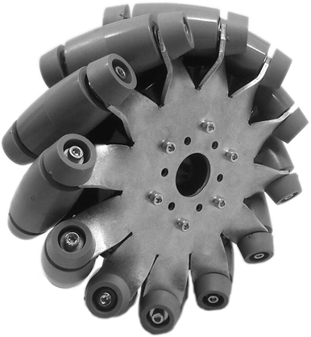
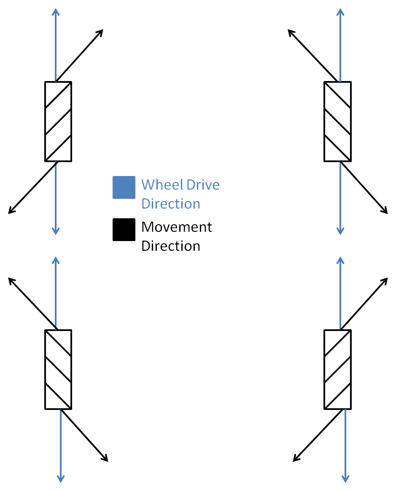



# How a Mecanum Drive Works

Based on document written by Dawson Bowhay, with additions and design changes by Jacob van't Hoog.

You'll need Javascript for this.

In a mecanum drive, wheels are arranged similarly to a tank drive. This means that spinning all wheels forward or backward allows the robot to move forward and backward, and spinning the wheels on one side in the opposite direction of the other side allows for turning. But what makes a mecanum drive special is its ability to move in any direction, including sideways (“strafing”).

What gives a mecanum drive this ability is the diagonal rollers on the wheels placed at 45 degree angles. These rollers mean that the wheels exert force in a diagonal direction. On a normal tank drive, wheels exert force forwards or backwards, limiting the robot to moving forwards, backwards, or turning. But by spinning the wheels of a mecanum drive in certain patterns, you can utilize the diagonal force created by the wheels to move the robot in any direction.

You can try an interactive Mecanum drive train simulation below:

<canvas data-processing-sources="../../sketches/mecanum/mecanum.pde ../../sketches/mecanum/Robot.pde ../../sketches/mecanum/MecanumDrive.pde ../../sketches/mecanum/DrawRobot.pde ../../sketches/mecanum/TankDrive.pde"></canvas>

## Lateral Movement Joystick

Before you can get to telling the wheels of the robot how to turn, you have to know which direction the robot needs to go. For driving, we prefer to use 2 joysticks: one for lateral movement, and one for turning. We will just focus on the lateral-movement joystick for now.

Whichever way you point that joystick, the robot will go that direction without turning. If you push the joystick forwards or backwards, the robot goes forward or backward. If you push the joystick sideways, the robot should drive sideways.

In addition to knowing which direction to go, you also have to determine how quickly to drive. For example, if you push the joystick slightly forward, the robot should drive forward slowly. But if you push the joystick forward as far as it can go, the robot should drive at top speed. This is the <em>magnitude</em> of the joystick.

 

So we have 2 factors for determining how the robot should move: Direction and Magnitude. wpilib has built-in methods of finding these for a joystick, but it's important to know how to calculate them yourself.

### Direction

In the code, joysticks will give you their x and y coordinates. What you’re after is the angle the joystick is pointed in. To do this, you can calculate <em>tan&minus;1(y/x)</em> (the inverse tangent of y/x). You will need to compensate for angles outside of the principal branch (between &minus;&pi;/2 and &pi;/2 radians), because the inverse tangents of those angles are the same as those of angles in the principal branch. Fortunately, most languages have a function called “atan2” instead of the regular “atan” which will fix this problem for you. In Python, you can <code>import math</code> and use <code>math.atan2(y, x)</code> as a more reliable replacement for tan&minus;1(y/x).

### Magnitude

For direction, you used trig to find the angle the joystick was pointed. For magnitude, you need to find the hypotenuse of the same triangle. The simplest way is to use the Pythagorean theorem: <em>a2+b2=c2</em>. By taking the square root of the joystick’s x coordinate squared plus the joystick’s y coordinate squared, you get the length of the hypotenuse. In Python, you can square a number with <code>number ** 2.0</code>, so to calculate the magnitude, you use <code>math.sqrt( x ** 2.0 + y ** 2.0 )</code>. The x and y values on a joystick usually go from &minus;1 to 1, so the magnitudes will always be between 0 and 1. So if you later solve for the wheel power at top speeds, you can simply multiply by the magnitude to go the right speed.

Another thing to be careful of is the area in which the joystick can move. We’re assuming the joystick can move in a circular-shaped area, where the maximum hypotenuse (or magnitude) is 1. If the joystick moves around in a square-shaped area, however, the maximum hypotenuse is 1.414. In that case, you would need to make sure any magnitude value greater than 1 is scaled down to 1.

## Analyzing Mecanum Wheels

Based on which direction the driver needs to move, we need to determine how fast to spin each mecanum wheel.

The above picture shows the directions that each mecanum wheel exerts force (the rollers shown are the ones touching the ground, not the ones on the top of the wheels). The easiest way to figure out how to spin the wheels in order to move in the desired direction is to make a table for each wheel. Full power forwards is 1, full power backwards is &minus;1, and no power is 0.

<table border="1">
<tr>
<td></td>
<td>1/4 &pi; Radians</td>
<td>3/4 &pi; Radians</td>
<td>5/4 &pi; Radians</td>
<td>7/4 &pi; Radians</td>
</tr>

<tr>
<td>Front-Right</td>
<td>0</td>
<td>1</td>
<td>0</td>
<td>&minus;1</td>
</tr>

<tr>
<td>Front-Left</td>
<td>1</td>
<td>0</td>
<td>&minus;1</td>
<td>0</td>
</tr>

<tr>
<td>Back-Left</td>
<td>0</td>
<td>1</td>
<td>0</td>
<td>&minus;1</td>
</tr>

<tr>
<td>Back-Right</td>
<td>1</td>
<td>0</td>
<td>&minus;1</td>
<td>0</td>
</tr>
</table>

The table above shows the power needed to drive each wheel at the given angles. If you plot the points, they turn out to be sine equations. The front-right and back-left wheels are controlled by <em>y=sin(x&minus;1/4&pi;)</em>, where x is the angle the robot needs to drive and y is the power for the wheel. The front-left and back-right wheels are controlled by <em>y=sin(x+1/4&pi;)</em>.

 

## Putting It Together and Adding Turn

Most of the work has been done at this point, everything just needs to be put together and a few tweaks need to be made. The code you write should use the joystick x and y to obtain an angle, and the length of the hypotenuse of the triangle that the x and y coordinates make (the magnitude).

The front-right and back-left wheel should be set to <em>sin(angle&minus;1/4&pi;) * magnitude</em>. The front-left and back-right wheel should be set to <em>sin(angle+1/4&pi;) * magnitude</em>.

Now the robot has the ability to move laterally in any direction - <em>almost</em>. For most robots, in order to work right, the 2 wheels on one side of the robot need to be inverted because they face the opposite direction. This can be done in a number of ways. For example, if the front-left wheel needed to be inverted, it could instead be set to <em>&minus;sin(angle+1/4&pi;) * magnitude</em>.

Finally, the robot can move laterally. But there’s one more step: turning. Fortunately, the robot can be easily programmed to turn, even at the same time as it’s driving. We will use a second joystick for this purpose, using horizontal movement to turn the robot (the x-axis). The range of turn values, hence the range of joystick x-axis feedback, should be between
[&minus;1, 1]. In the code, the Talon motor controller for each wheel can simply be set to this turn value, no inverting required, and the robot can be turned. But you want to be able to strafe and turn simultaneously, so there’s a bit more work.

The turn value for each wheel should be added to the lateral movement value for each wheel. It’s actually pretty simple. For example, now our inverted front-left wheel would be set to <em>&minus;sin(angle+1/4&pi;) * magnitude + turn</em>. If you simply add the turn value to the lateral movement value, each wheel will work fine. There’s only one problem: the maximum value a motor controller will take is 1 (or &minus;1, in the negative direction). Anything larger will just be scaled down to 1, creating distortion in our results. So, now that we’ve added up the lateral movement and turn for each wheel, if any are greater than 1, or less than &minus;1, they all need to be scaled by the same factor so that the largest one is one. This factor is easy to obtain: it is the absolute value of the largest (or least, if on the negative side) value. Now the value for each wheel just has to be divided by this factor, and the drive will work.

